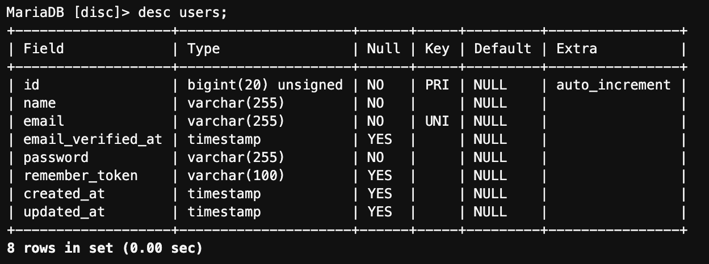
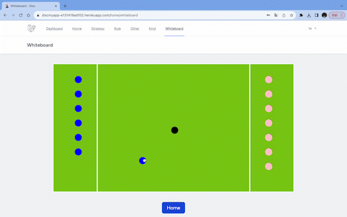

# [Bulletin board for DualBoot](https://discmyapp-e131419ad102.herokuapp.com)

 
 

## 制作背景

私は大学でアルティメット部に所属しています。  

そこでは毎年チームメンバーが変わるごとに同じような内容の壁にぶつかり、解決するのにたくさんの練習時間を費やしてしまいます。  
その時間を短縮するために、項目ごとにまとめられるwebアプリケーションがあれば便利だと思い開発しました。  

LINEのノート機能でもいいという意見が出そうですが、チームの連絡にグループLINEを使っています。毎年新しい新しいLINEグループを作成するため、Note機能では不十分なのです。

 
 

## 概要

僕の所属している部活の戦略や、ルール、その他情報として残っていたら便利なことを記録できるwebアプリケーションです。

また、記録機能に加え、ホワイトボードも実装しました。
スマホ一台あればどこでも作戦会議ができます。

[アプリを使ってみる](https://discmyapp-e131419ad102.herokuapp.com)

 
 

## 開発環境

### 使用言語：

- PHP
- HTML
- CSS（tailwindcss)
- JavaScript(React)

### 環境：

- Laravel(9.52.9)
- MySQL(MariaDB)
- AWS(EC2＋Cloud9)
- Github
### デプロイ：
- Heroku

 
 

## データ構成

### 「テーブル構成・リレーション」:

### 各テーブル詳細：
. 
. 
. 
. 
. 

## 機能

- CRUD
- ログイン
- 戦略のタイトル、内容、URL、戦略の種類の投稿、表示
- ルールとその他のタイトル、内容、URLの投稿、表示
- 戦略の種類の作成
- コートと選手、ディスクを使って動きの確認や戦略の話し合いが可能

## こだわり

####  **選手とでディスクに見立てたオブジェクトを自由に動かせ、いつでもどこでも視覚的にわかりやすい作戦会議が可能です。**

下のgifはオブジェクトを動かしているデモです。

## 使い方

#### **戦略を記録したいユーザー：** 

タイトル、内容、種類、必要があればURLを記述し、投稿します。  
もし戦略の種類に望むものがなければ自作することが可能です。

#### **ルールやその他のことを記録したいユーザー：** 

タイトル、内容、必要があればURLを記述し、投稿します。

#### **記録されている情報を見たいユーザー：** 
戦略、ルールとその他の項目があるので見たい内容のページにボタンを押して遷移してください。

戦略では戦略の種類ごとに一覧で閲覧することが可能です。

## 今後の計画

- ページの読み込み速度の向上
- 知りたい内容のタイトルまたは内容検索の実装
